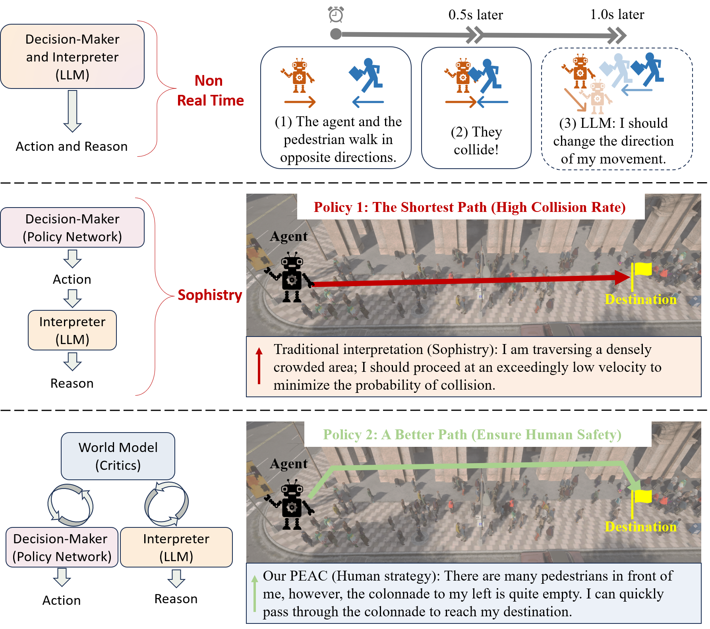
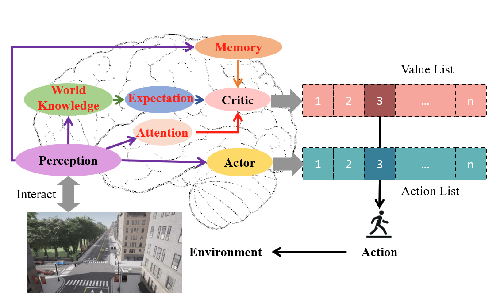
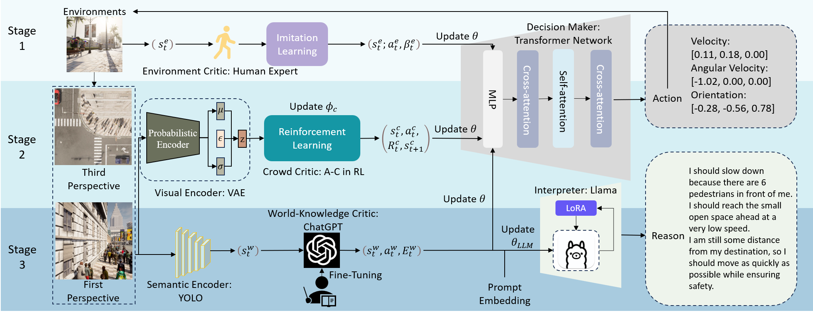
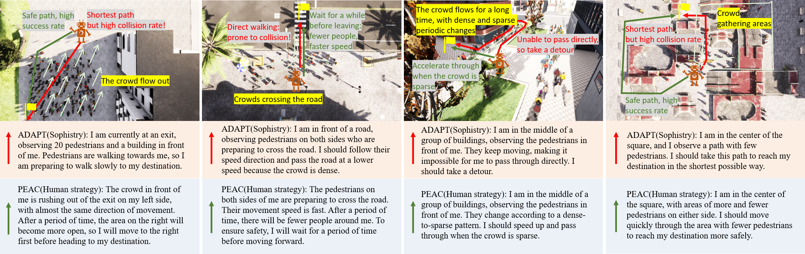

# Background

## Interpretable Navigation

The emergence of LLMs offers a potential direction for interpretability. Some studies started focusing on the interpretability of decision-making in navigation.

**This is mainly for AI safety considerations. For example, in autonomous driving, the model would output both the decision "stop" and the reasoning explanation "I see a red light, so I choose to stop".**

## Sophistry Phenomenon

  

The use of LLMs in navigation can be categorized into two approaches. The first approach treats the LLM as a decision-maker. However, in the field of robotic navigation, agents need to perform real-time motion planning, but the response time of LLMs is insufficient for planning tasks. 

Therefore, the second approach involves using the LLM as an interpreter, providing explanations for the agent's actions. 
However, in this approach, the motion planning unit and the LLM are serial, meaning that regardless of the agent's decision, the LLM must find a justification for it. 

**We refer to a behavior, where the LLM provides explanations for unreasonable decisions, as Sophistry. This phenomenon is concerning because even if the agent encounters a safety incident, the LLM will still describe its actions as rational.**

# PEAC: Perception Emulated Actor Critic

* We propose PEAC: Perception Emulating Actor-Critic, a method that emulates human behavioral perception and effectively addresses the the sophistry regarding unreasonable decisions in crowd scenarios.
* We introduce a three-stage training framework that enables real-time interaction with dynamic environments, achieving superior decision-making performance and facilitating Sim2Real transfer.
* In terms of ensuring AI safety through the interpretation of behaviors, we provide a novel dataset for robot navigation tasks and an embedded LLM network paradigm that accepts vector and prompt features as inputs.

## World Model

  

    
    
Traditional Actor-Critic Method

  

  

    
    
Our PEAC: Perception-Emulating Actor-Critic Method

  

## Framework

# Experiments

## Simulation

### Quantitative Results

<table>
  <tr>
    <th rowspan="2">Methods</th>
    <th rowspan="2">Algorithm</th>
    <th rowspan="2">Research Work</th>
    <th colspan="3">Validation Seen</th>
    <th colspan="3">Validation Unseen</th>
    <th colspan="3">Test Unseen</th>
  </tr>
  <tr>
    <th>SR↑</th>
    <th>SD↓</th>
    <th>AT↓</th>
    <th>SR↑</th>
    <th>SD↓</th>
    <th>AT↓</th>
    <th>SR↑</th>
    <th>SD↓</th>
    <th>AT↓</th>
  </tr>
  <tr>
    <td rowspan="4"><b>IL-Based</b></td>
    <td>IRL</td>
    <td>Pfeiffer et al.</td>
    <td>0.56</td>
    <td>72.76</td>
    <td>70.72</td>
    <td>0.25</td>
    <td>75.14</td>
    <td>107.58</td>
    <td>0.11</td>
    <td>76.85</td>
    <td>174.66</td>
  </tr>
  <tr>
    <td>AIRL</td>
    <td>Okal et al.</td>
    <td>0.43</td>
    <td><b>65.29</b></td>
    <td>121.99</td>
    <td>0.35</td>
    <td>89.14</td>
    <td>101.34</td>
    <td>0.12</td>
    <td>83.78</td>
    <td>192.94</td>
  </tr>
  <tr>
    <td>GAIL</td>
    <td>Tai et al.</td>
    <td>0.56</td>
    <td>74.22</td>
    <td>53.53</td>
    <td>0.52</td>
    <td>83.13</td>
    <td>63.10</td>
    <td>0.30</td>
    <td>90.68</td>
    <td>89.98</td>
  </tr>
  <tr>
    <td>ILPP</td>
    <td>Qin et al.</td>
    <td>0.67</td>
    <td>77.44</td>
    <td>33.32</td>
    <td>0.49</td>
    <td>82.52</td>
    <td>54.57</td>
    <td>0.24</td>
    <td>90.47</td>
    <td>73.14</td>
  </tr>
  <tr>
    <td rowspan="11"><b>RL-Based</b></td>
    <td>MAXQ</td>
    <td>Cai et al.</td>
    <td>0.63</td>
    <td>80.56</td>
    <td>30.60</td>
    <td>0.34</td>
    <td>92.45</td>
    <td>41.96</td>
    <td>0.07</td>
    <td>59.65</td>
    <td>148.67</td>
  </tr>
  <tr>
    <td>MGSMC</td>
    <td>Zhou et al.</td>
    <td>0.49</td>
    <td>81.20</td>
    <td>30.28</td>
    <td>0.37</td>
    <td>90.30</td>
    <td>44.43</td>
    <td>0.08</td>
    <td>60.59</td>
    <td>164.72</td>
  </tr>
  <tr>
    <td>A3C</td>
    <td>Shi et al.</td>
    <td>0.64</td>
    <td>76.98</td>
    <td>28.30</td>
    <td>0.30</td>
    <td>109.81</td>
    <td>71.42</td>
    <td>0.20</td>
    <td>74.28</td>
    <td>69.49</td>
  </tr>
  <tr>
    <td>PG</td>
    <td>Geng et al.</td>
    <td>0.52</td>
    <td>82.73</td>
    <td>31.47</td>
    <td>0.36</td>
    <td>81.03</td>
    <td>68.55</td>
    <td>0.30</td>
    <td>82.20</td>
    <td>53.95</td>
  </tr>
  <tr>
    <td>TRPO</td>
    <td>Walker et al.</td>
    <td>0.60</td>
    <td>79.37</td>
    <td>31.38</td>
    <td>0.42</td>
    <td>89.50</td>
    <td>42.29</td>
    <td>0.08</td>
    <td>60.60</td>
    <td>158.40</td>
  </tr>
  <tr>
    <td>DDPG</td>
    <td>Chai et al.</td>
    <td>0.42</td>
    <td>87.48</td>
    <td>38.19</td>
    <td>0.22</td>
    <td>73.65</td>
    <td>37.04</td>
    <td>0.16</td>
    <td>64.40</td>
    <td>91.35</td>
  </tr>
  <tr>
    <td>DQN</td>
    <td>Escobar et al.</td>
    <td>0.65</td>
    <td>87.40</td>
    <td>36.25</td>
    <td>0.51</td>
    <td>79.70</td>
    <td><b>31.09</b></td>
    <td>0.43</td>
    <td>82.29</td>
    <td>58.96</td>
  </tr>
  <tr>
    <td>D3QN</td>
    <td>Li et al.</td>
    <td>0.45</td>
    <td>83.31</td>
    <td>37.52</td>
    <td>0.40</td>
    <td>88.92</td>
    <td>42.71</td>
    <td>0.25</td>
    <td>74.73</td>
    <td>64.01</td>
  </tr>
  <tr>
    <td>TD3</td>
    <td>Neamah et al.</td>
    <td>0.57</td>
    <td>80.73</td>
    <td>32.26</td>
    <td>0.24</td>
    <td>86.25</td>
    <td>52.64</td>
    <td>0.16</td>
    <td>67.26</td>
    <td>100.75</td>
  </tr>
  <tr>
    <td>PPO</td>
    <td>Taheri et al.</td>
    <td>0.61</td>
    <td>81.29</td>
    <td>30.28</td>
    <td>0.40</td>
    <td>86.23</td>
    <td>39.77</td>
    <td>0.06</td>
    <td>66.15</td>
    <td>159.80</td>
  </tr>
  <tr>
    <td>SAC</td>
    <td>Wen et al.</td>
    <td>0.67</td>
    <td>81.79</td>
    <td>30.81</td>
    <td>0.62</td>
    <td>86.84</td>
    <td>37.22</td>
    <td>0.45</td>
    <td>75.65</td>
    <td>64.59</td>
  </tr>
  <tr>
    <td colspan="2"><b>PEAC</b></td>
    <td>Ours</td>
    <td><b>0.70</b></td>
    <td>82.04</td>
    <td><b>26.17</b></td>
    <td><b>0.66</b></td>
    <td><b>70.35</b></td>
    <td>36.22</td>
    <td><b>0.46</b></td>
    <td><b>53.60</b></td>
    <td><b>43.95</b></td>
  </tr>
</table>

### Qualitative Results

  

    <video width="100%" controls>
      <source src="./video/ADAPT-1.mp4" type="video/mp4">
    </video>
    
Scene 1 - ADAPT

  

  

    <video width="100%" controls>
      <source src="./video/PEAC-1.mp4" type="video/mp4">
    </video>
    
Scene 1 - PEAC

  

  

    <video width="100%" controls>
      <source src="./video/ADAPT-2.mp4" type="video/mp4">
    </video>
    
Scene 2 - ADAPT

  

  

    <video width="100%" controls>
      <source src="./video/PEAC-2.mp4" type="video/mp4">
    </video>
    
Scene 2 - PEAC

  

  

    <video width="100%" controls>
      <source src="./video/ADAPT-3.mp4" type="video/mp4">
    </video>
    
Scene 3 - ADAPT

  

  

    <video width="100%" controls>
      <source src="./video/PEAC-3.mp4" type="video/mp4">
    </video>
    
Scene 3 - PEAC

  

  

    <video width="100%" controls>
      <source src="./video/ADAPT-4.mp4" type="video/mp4">
    </video>
    
Scene 4 - ADAPT

  

  

    <video width="100%" controls>
      <source src="./video/PEAC-4.mp4" type="video/mp4">
    </video>
    
Scene 4 - PEAC

  

## Real-world

### Quantitative Results

### Qualitative Results

  

    <video width="100%" controls>
      <source src="./video/SAC-1.mp4" type="video/mp4">
    </video>
    
SAC

  

  

    <video width="100%" controls>
      <source src="./video/SAC-2.mp4" type="video/mp4">
    </video>
    
SAC

  

  

    <video width="100%" controls>
      <source src="./video/PEACr-1.mp4" type="video/mp4">
    </video>
    
PEAC

  

  

    <video width="100%" controls>
      <source src="./video/PEACr-2.mp4" type="video/mp4">
    </video>
    
PEAC

  

